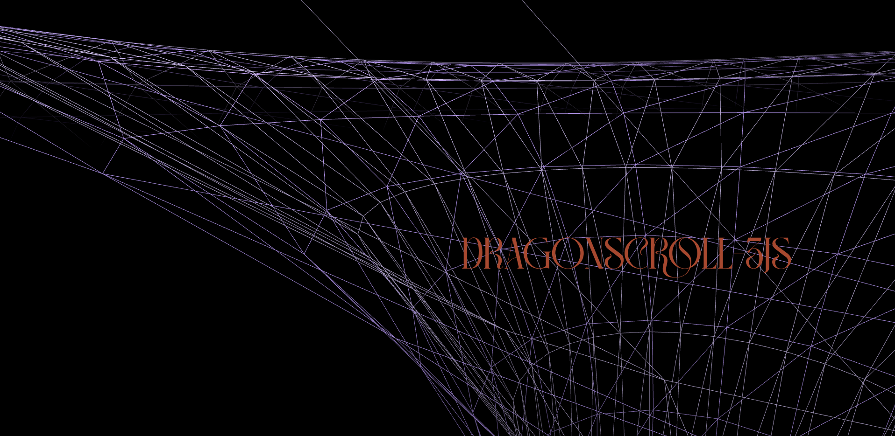

# Dragon3D: A Student Project in 3D Animation

Welcome to Dragon3D! This project is an exploration into the realm of 3D animations using 3JS and TypeScript. As a student endeavor, it showcases our journey in learning and implementing modern web technologies to create an interactive experience.

## About the Project
Dragon3D invites users to navigate through a series of scenes involving a dragon statue.  The website is a playground for experimenting with 3D models and animations, offering a simple yet engaging way to showcase our skills in web development and design.

## Screenshots

### Home Screen

### Scene Exploration

## Features

- **Interactive 3D Animations**: The centerpiece of our project is the dragon statue, brought to life with detailed 3D modeling.
- **Scroll-Based Navigation**: Users can move from one scene to another using a smooth scrolling mechanism, enhancing the interactive experience.
- **GSAP for Animations**: We've used GSAP to ensure fluid and responsive animations throughout the website.

## Technical Stack

- **3JS and TypeScript**: These form the core of our project, enabling us to create and manipulate 3D content.
- **GSAP**: A powerful tool for creating professional-grade animations.

## The Website

Experience Dragon3D at [https://dragon3d.vercel.app/](https://dragon3d.vercel.app/). The site is a demonstration of our learning and progress in the field of web-based 3D animation.

## Acknowledgements

- A special thanks to Vincent for contributing to the 3D model of the dragon.

## Team

- Adnan Boudjelal
- Ludivine Novillo

As creators, we hope Dragon3D provides a glimpse into our capabilities and potential in the world of web development and 3D animation!
